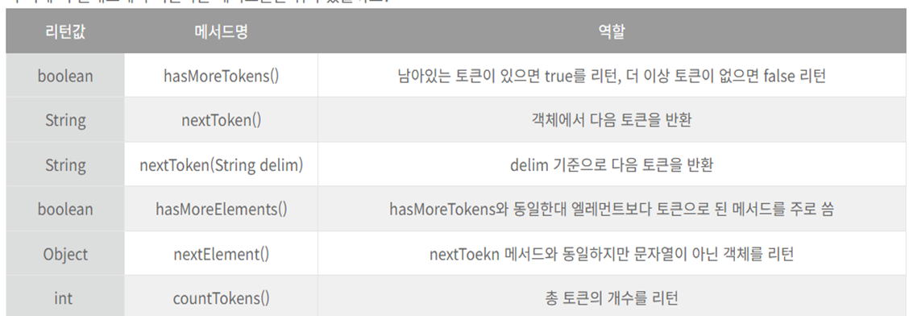

 # string 문법 정리
     1.	str1.compareTo(str2)                                  // 사전순에 따라 앞 문자 기준 -, 0, +       
     2.	str1.concat(str2)                                    // Str1+str2 문자연결
     3.	str1.contains(ch or str)                            // Str1에 ch 문자를 포함할경우 true
     4.	str.trim()                                         // 문자열 앞뒤 공백, /\, /t 제거
     5.	str.replace(“a”,”b”)                              // 문자열 안에있는 단어를 대치
     6.	String s[] = str.split(“,”)  + split(“&|,|-”)    // 문자열에 , 를 기준으로 배열에 분리
     7.	Int index = str.indexOf(“자바”)                 // 해당 문자열이 있는 index 리턴 or -1
     8.	Str2 = str1.substring(5) , (3,5)               // 문자열 자르기 5부터끝, 3부터5 
     9.	System.arraycopy(arr,0,newarr,0,arr.length)   // Arr의 0번부터 newarr의 0번으로 복사  
               == Str1.clone(str2);   

 # StringBuffer, StringBuilder (문자열 수정 용이)
     1. Sb.append(str)               // Sb에 str 문자열을 붙임
     2. Sb.insert(2, str)           // Sb에 2 index 부터 문자열을 붙임
     3. Sb.replace(2,6,str)        // Sb에 2~5 사이 문자를 str로 바꿈
     4. Sb.delete(0,2)            // Sb에 0~2 영역 분자 삭제
     5. Sb.reverse()             // Sb에 문자열을 뒤집음
     6. Sb.setLength(3)         // 문자열 길이 재설정 클 경우 null, 아니면 자름

 # List 사용법 정리
     0.     List<Integer> numbers = new ArrayList<>();                                   
     1.	Numbers.clear();                                                            
     2.	numbers.contains(100);                                                     // 100이 존재하는지 true or false
     3.	numbers.get(0);                                                           // 0번째 인덱스의 값
     4.	numbers.indexOf(30);                                                     // 30 값의 인덱스 return 없으면 -1
     5.	numbers.lastIndexOf(80)                                                 // 해당 값의 마지막 위치 리턴
     6.	numbers.remove(0);                                                     // 0번 인덱스 삭제
     7.	numbers.remove(Integer.valueOf(100));                                 // 값이 100 삭제
     8.	numbers.removeAll(newNumbers);                                       // 리스트를 만들어서 이에 해당하는 값 다 삭제
     9.	Collections.sort(numbers);                                          // 오름차순 정렬
     10.	Collections.reverse(numbers);                                      // 내림차순 정렬
     11.	List<Integer> newNumbers = numbers.subList(1,3);                  // 1~3 인덱스에 해당하는 값으로 리스트 생성
     12.	Integer[] array = numbers.toArray(new Integer[numbers.size()]);  // 배열로 변경하기
     13.	List<String> friday = new ArrayList<>(Arrays.asList(array));    // 배열을 다시 리스트로
     14.    friday.forEach(f -> System.out.print(f));                      // 리스트의 각 값을 f로 치환해 사용

 # 난수 생성
    (int) (Math.random() * 12) + 1   // 1~12 난수 생성

 # Char -> 숫자 변환
    Int a = ‘7’ - ‘0’       // Char 한자리 수를 숫자로 변환할 떄는 – ‘0’

 # 문자열을 Char 배열에 저장
    char[] ch = str.toCharArray();

# 배열 전체 요소를 한 줄로 출력
    Import java.util.Arrays;
    Arrays.toString(arr); -> [7, 6, 9, 3]

 # StringTokenizer 정리

